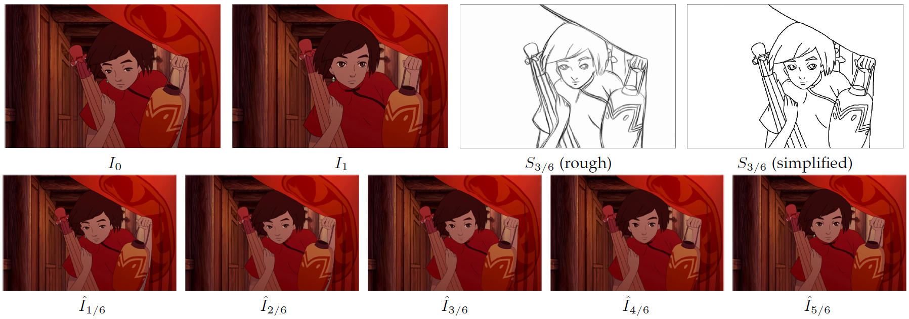

# Inbetweening
### [Paper](https://arxiv.org/abs/2008.04149) | [DOI](https://doi.org/10.1109/TVCG.2021.3049419) | [Video](https://youtu.be/qeNcjlAFqVo)

The source code of Deep Sketch-guided Cartoon Video Inbetweening by Xiaoyu Li, Bo Zhang, Jing Liao, Pedro V. Sander, IEEE Transactions on Visualization and Computer Graphics, 2021.



## Prerequisites
- Linux or Windows
- Python 3
- CPU or NVIDIA GPU + CUDA CuDNN

### Use the Pre-trained Models
You can download the pre-trained model [here](https://drive.google.com/file/d/1wn4MfKv2bTH_EWobZB-nE875s9l913rq/view?usp=sharing).

Run the following commands for evaluting the frame synthesis model and full model:
```bash
python eval_synthesis.py
python eval_full.py
```
The frame synthesis model takes img_0, img_1, ske_t as inputs and synthesizes img_t.
The full model takes img_0, img_1, ske_t as inputs and interpolates five frames between img_0 and img_1.

## Datasets
A dataset is a directory with the following structure:

    dataset
        ├── frame
        │   └── ${clip_id}
        │       └──${image_id}.png
        ├── sketch
        │   └── ${clip_id}
        │       └──${image_id}.png
        └── dismap
            └── ${clip_id}
                └──${image_id}.npy
                
The sketch images can be generated by the script "sketch.py" and the distance maps can be generated by "dismap.py". Due to the copyright issue of the movie Spirited Away, we can not release our training dataset. You can generate your own dataset if you interest.

## Training
Run the following command for training the frame synthesis model and full model:
```bash
python train_synthesis.py
python train_full.py
```
Before you train the full model, you must train the frame synthesis model first and use its parameters to initialize the full model.

## Citing
If you find our work useful, please consider citing:
```BibTeX
@article{li2021deep,
  author    = {Li, Xiaoyu 
               and Zhang, Bo 
               and Liao, Jing
               and Sander, Pedro},
  title     = {Deep Sketch-guided Cartoon Video Inbetweening},
  journal   = {IEEE Transactions on Visualization and Computer Graphics},
  year      = {2021},
}
```
